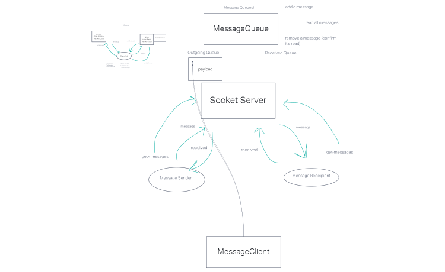

# caps-phase-3

## Deployment
How do I install the app or library? Clone this app and install all dependencies.

How do I test the app or library? Run "NPM test" in the terminal once all dependencies are installed.

For Applications: How do I run the app? You can run the app on your local terminal. How do I set up the app? Be sure to install all dependencies.

## Testing
Write a complete set of tests for all functional units and modules

You can run [npm test] on the terminal to run tests:
 testing event handlers
    ✓ Driver should confirm package was picked up
    ✓ Driver should confirm package is delivered
    ✓ Vendor should confirm package was received

You must open the server and, at least, one client in order to have the sockets communicating.

Enter the following commands in separate terminals to start:

- Server: [node src/Global/handleGlobal.js]
- Driver: [node src/Driver/handleDriver.js]
- Vendor: [node src/Vendor/handleVendor.js]

## Documentation

